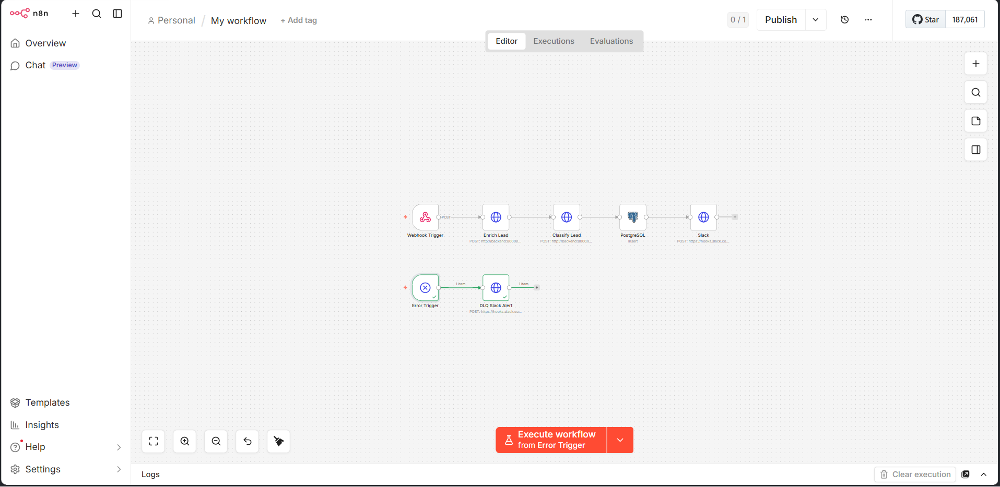
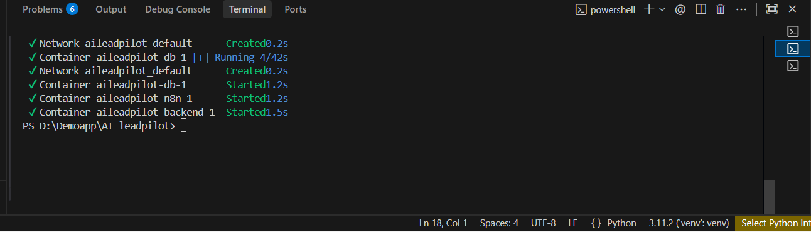
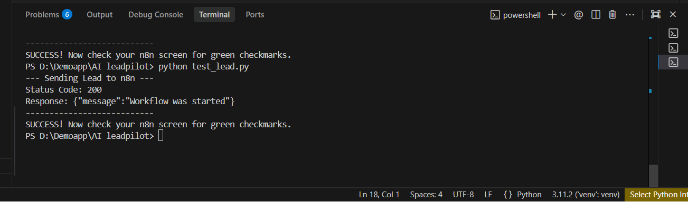
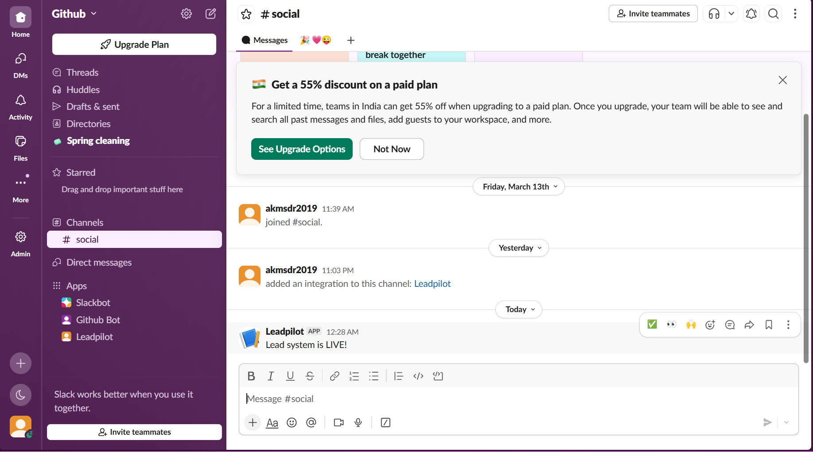
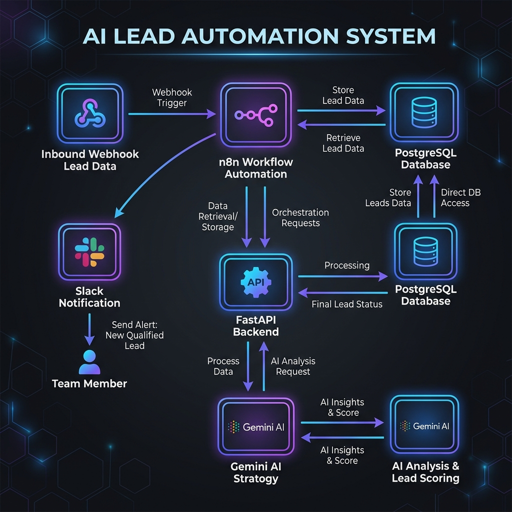

# 🚀 AI LeadPilot: Production-Grade Lead Automation System

## 🌟 Overview
**AI LeadPilot** is a state-of-the-art automation pipeline designed to handle the full lifecycle of an incoming lead. It combines the orchestration power of **n8n** with a high-performance **FastAPI** backend and **Google Gemini AI** to transform raw lead data into actionable business intelligence.

This system is built for **Aviara Labs** as a demonstration of production-ready AI automation, focusing on scalability, reliability, and clean engineering principles.

---

## 🏗️ How It Works (The Pipeline)



1.  **Ingestion**: A lead is received via a Webhook (Name, Email, Company, Message).
2.  **Enrichment**: The system calls the FastAPI backend to derive metadata (Industry, Company Size, LinkedIn URL).
3.  **Intelligence**: The lead's message is processed by **Gemini AI** to classify the "Intent" (Sales, Support, Partnership) and assign a confidence score.
4.  **Persistence**: The enriched and classified data is stored in a structured **PostgreSQL** database.
5.  **Notification**: Real-time alerts are sent to **Slack**, providing the team with instant context.

---

## 🛠️ Tech Stack
- **Orchestration**: n8n
- **Backend**: Python 3.11, FastAPI
- **AI Engine**: Google Gemini AI (Generative AI SDK)
- **Database**: PostgreSQL 15
- **Infrastructure**: Docker & Docker Compose
- **Security**: X-API-Key Header Authentication

---

## 🚀 Local Setup Guide

### 1. Clone the Repository
```bash
git clone https://github.com/Adarsh09675/AI-leadpilot.git
cd AI-leadpilot
```

### 2. Configure Environment Variables
Navigate to the `backend/` folder and create a `.env` file:
```bash
# API Configuration
API_KEY=aviara-secret
PROJECT_NAME=AI-LeadPilot
VERSION=1.0.0

# AI Configuration (Get your key at aistudio.google.com)
GEMINI_API_KEY=your_google_gemini_api_key

# Database Configuration
DATABASE_URL=postgresql://postgres:postgres@db:5432/leadpilot

# Slack Configuration
SLACK_WEBHOOK_URL=your_slack_webhook_url
```

### 3. Launch with Docker
Run the following command to start the Backend, Database, and n8n:
```bash
docker-compose up --build -d
```


*Wait about 30 seconds for all services to initialize.*

### 4. Setup n8n Workflow
1. Open **[http://localhost:5678](http://localhost:5678)** in your browser.
2. Click the **...** menu (top right) and select **Import from File**.
3. Choose the **`n8n_workflow_export.json`** file from the project root.
4. **PostgreSQL Connection**:
   - Open the PostgreSQL node.
   - Click "Create New Credential".
   - Host: `db` | DB: `leadpilot` | User: `postgres` | Password: `postgres`.
5. Click **Execute Workflow** to start listening.

---

## 🧪 Testing the System
We've included a dedicated test script to bypass common terminal quoting issues.

1. Install requirements: `pip install requests`
2. Run the test:
```bash
python test_lead.py
```


Check your **n8n canvas** for green checkmarks and your **Slack channel** for the notification!

### 🔔 Slack Notification


---

## 📐 System Architecture & Reliability



### Scalability
- **Modular Routers**: The FastAPI app is split into services and routers, allowing independent scaling of endpoints.
- **Architecture is Worker-Ready**: Designed for seamless integration with **Celery/Redis** background workers as traffic grows.

### Reliability
- **Dead Letter Queue (DLQ)**: A dedicated failure path is implemented in n8n via an Error Trigger to route failed items separately for review.
- **Idempotency Awareness**: Design considerations were taken into account for future scaling and deduplication logic.
- **Infrastructure is Cache-Ready**: A Redis service is included in the Docker stack for immediate implementation of caching layers.

---

## 📖 API Documentation
Once the system is running, access the interactive Swagger documentation at:
- **Swagger UI**: [http://localhost:8000/docs](http://localhost:8000/docs)
- **Health Check**: `GET http://localhost:8000/health`

---

## 👤 Author
**Adarsh**  
*AI Automation Engineer Candidate*
